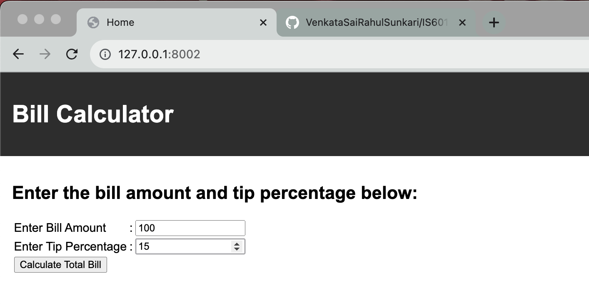
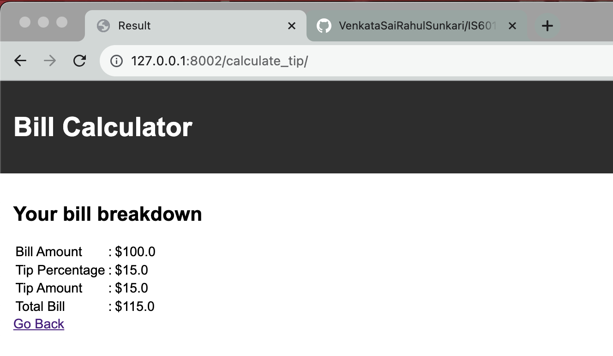

# IS601101-A4
Assignment 4

# How to run this application
- Make sure make is installed on your machine. Or else refer to the Makefile for the actual shell command.
```shell
python -mvenv venv
source /venv/bin/activate
pip install -r requirements.txt
cd tipCalc
make run
```

# Details
- Everything is developed in the default application i.e. tipCalc
- Used template inheritance

# Code
[django code](https://github.com/VenkataSaiRahulSunkari/IS601101-A4/tree/main/tipCalc)

# Output
## Form


## Result
